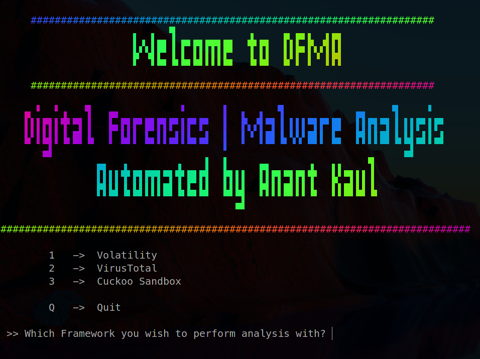
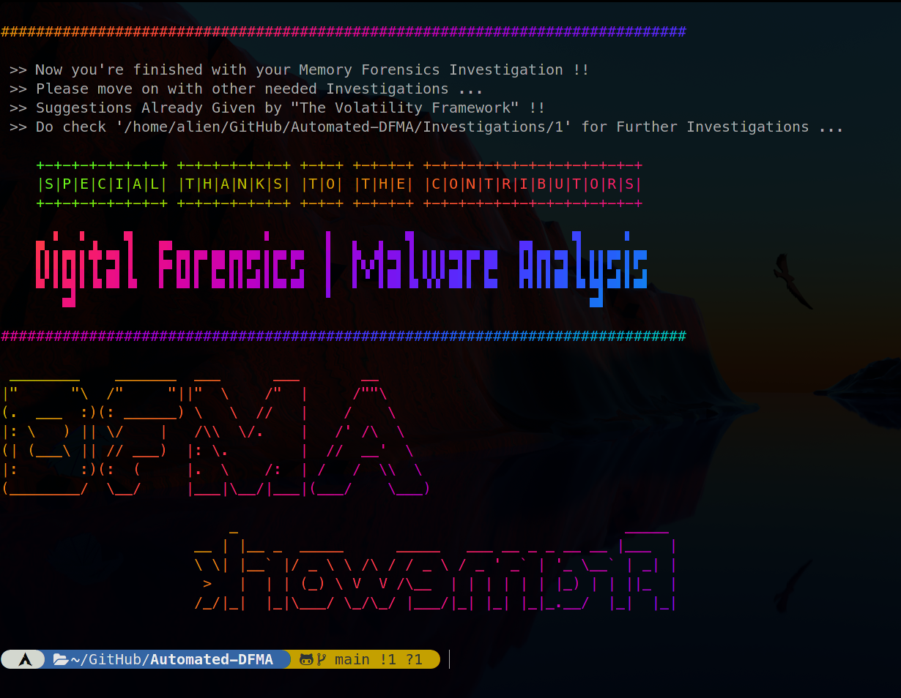

# Automated-DFMA
The advanced Automated-DFMA framework is a Digital Forensics and Malware Analysis Framework built on top of Volatility 3/2, VirusTotal API and Cuckoo Sandbox with a Menu-Driven Shell Script and integration using Python, full of automations, developed & maintained exclusively by <href src="https://github.com/anantkaul/anantkaul">@anantkaul.

1) **Volatility 3/2 >>** The advanced volatile memory extraction framework. <br>
2) **VirusTotal API >>** An online service that analyzes suspicious files and URLs to detect types of malware and malicious content using antivirus engines and website scanners. It provides an API that allows users to access the information generated by VirusTotal.<br>
3) **Cuckoo Sandbox >>** The leading open source automated malware analysis system.

All these integrated in one single framework **Automated-DFMA** making the process automated and integrated through its menu driven command-line interface (CLI).

Volatility2 helps out when no availability of plugins in Volatility3 ...
  
Full Documentation
---
- [Wiki](https://fantastic-teeth-031.notion.site/Automated-DFMA-e8f7d52b3bcf4d1396c9a92df11c115d)  

Getting Started 
---
### Install
```sh
git clone https://github.com/anantkaul/Automated-DFMA.git
cd Automated-DFMA
./install.sh
```

### Simply Run
```sh
./auto-DFMA.sh
```

Some Useful Operations
---
<!-- ### Sample Error & Resolution !! 
 -->

- [Main-Menu](meta/images/1-Main-Menu.png)
- [Volatility Prompted for File !!](meta/images/2-Vol-File-Prompt.png)
- [Driven Menu for Volatility Plugins !!](meta/images/3-Vol-Menu.png)
- [Driven Menu for VirusTotal API !!](meta/images/4-VT-Menu.png)

Happy Ending !!
---


Thank you! 🐑 
---
**You can find me on**

[][GitHub]
[][Discord]
[][linkedin]
[][twitter]
[][youtube]

[GitHub]: https://github.com/anantkaul
[Discord]: https://discordapp.com/users/4N4N7#8325
[LinkedIn]: https://www.linkedin.com/in/anant-kaul/
[Twitter]: https://twitter.com/AnantKaul
[YouTube]: https://www.youtube.com/channel/UC7bflmCt91Om9HlBZDcTAmw 
[Invite]: https://discord.gg/2S8CHuqphD

###### tags: `Digital Forensics` `Malware Analysis` `Volatility` `VirusTotal` `Cuckoo` `Sandbox`
