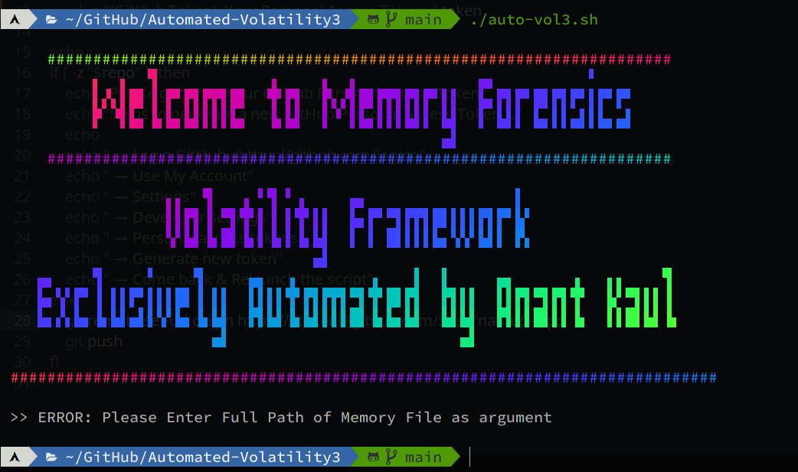
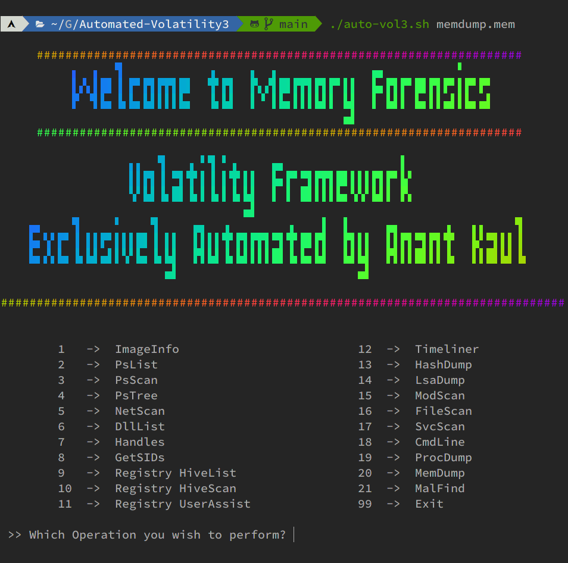
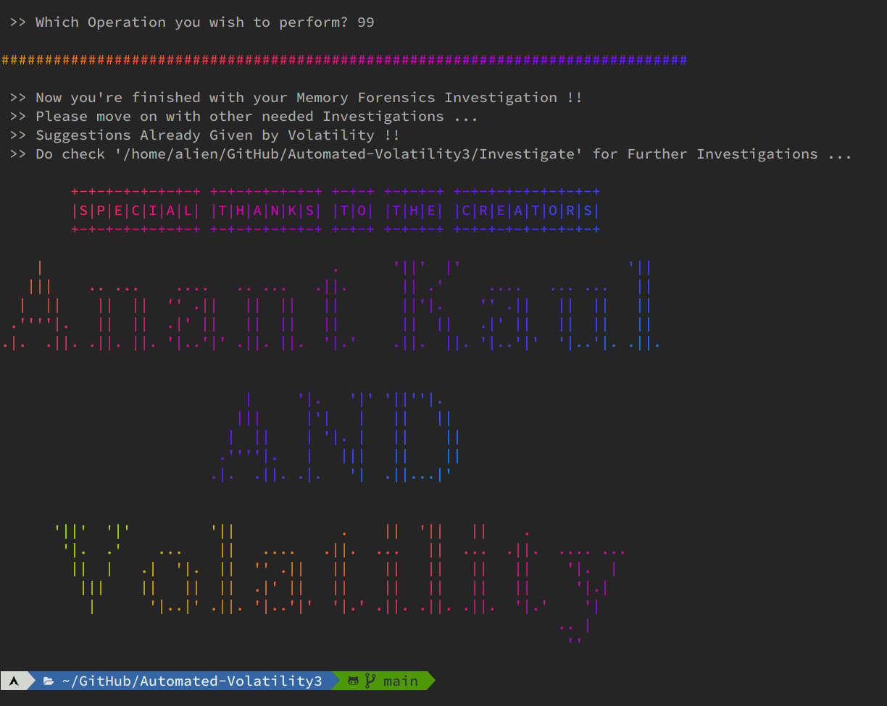

# Automated-DFMA
Memory Forensics using Volatility3 & Volatility2 (only for some edge cases) made automated with a Menu-Driven Shell Script (Framework) full of automations, developed & maintained exclusively by anantkaul.

Volatility2 helps out when no availability of plugins in Volatility3 ...

### Install
```sh
git clone https://github.com/anantkaul/Automated-DFMA.git
cd Automated-DFMA
./install.sh
```

### Sample Error & Resolution !!


### Driven Menu for Volatility Plugins !!


### Happy Ending !!


